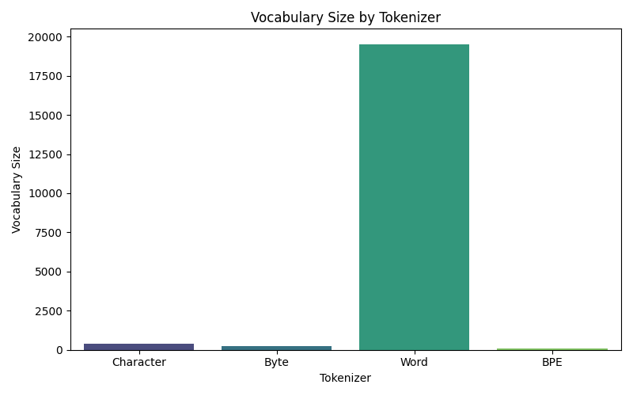
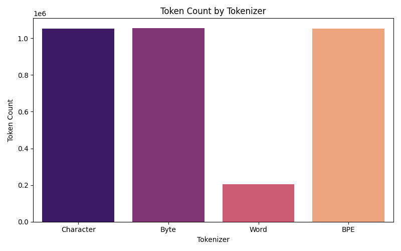
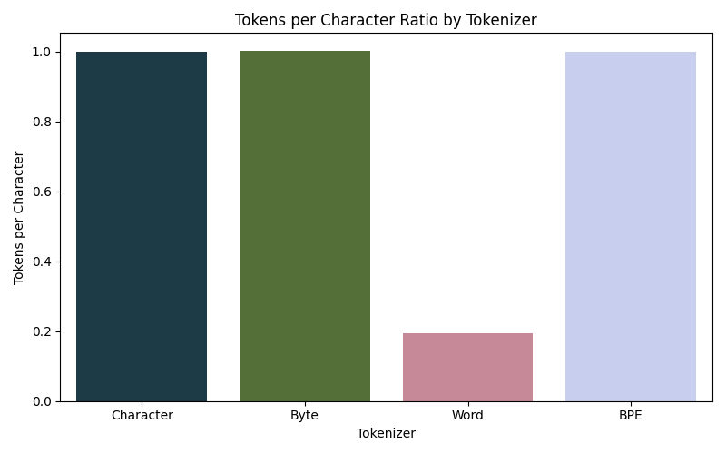
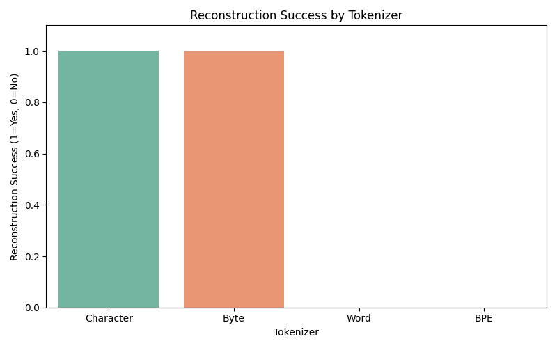

# tale-of-tokenizations: comparing tokenizer types in NLP


## Tokenizer Overviews

### 1. Character Tokenizer
- **Description:** Splits text into individual characters.

- **Example:**
  ```
  Input: YMCA in South Australia
  Output: Y, M, C, A,  , i, n,  , S, o, ...
  See: [`text_files/Character_tokens.txt`](text_files/Character_tokens.txt)
  ```

### 2. Byte Tokenizer
- **Description:** Splits text into raw byte values (e.g., UTF-8 encoded bytes).

- **Example:**
  ```
  Input: YMCA in South Australia
  Output: 0x59, 0x4d, 0x43, 0x41, 0x20, 0x69, 0x6e, 0x20, 0x53, 0x6f, ...
  See: [`text_files/Byte_tokens.txt`](text_files/Byte_tokens.txt)
  ```

### 3. Word Tokenizer
- **Description:** Splits text into words based on spaces and punctuation.

- **Example:**
  ```
  Input: YMCA in South Australia
  Output: ymca, in, south, australia, south, australia, (, sa, ), has, ...
  See: [`text_files/Word_tokens.txt`](text_files/Word_tokens.txt)
  ```

### 4. Byte-Pair Encoding (BPE) Tokenizer
- **Description:** Learns a vocabulary of subword units, balancing between character and word tokenization.

- **Example:**
  ```
  Input: YMCA in South Australia
  Output: Y, M, C, A, <UNK>, i, n, <UNK>, S, o, ...
  See: [`text_files/BPE_tokens.txt`](text_files/BPE_tokens.txt)
  ```

---

## Visualizations


### Vocabulary Size by Tokenizer


### Token Count by Tokenizer


### Tokens per Character by Tokenizer


### Reconstruction Success by Tokenizer


---

## How to Reproduce

1. **Run Tokenization:**
   ```bash
   python test.py
   ```
   This will generate tokenized outputs in the `text_files/` directory.

2. **Generate Visualizations:**
   ```bash
   python tokenization_visualization.py
   ```
   This will save plots in the `images/` directory.

---

## Project Structure
- `test.py` — Runs all tokenizers and saves their outputs.
- `tokenization_visualization.py` — Generates comparative plots.
- `text_files/` — Contains tokenized outputs for each tokenizer.
- `images/` — Contains visualization PNGs.

---


